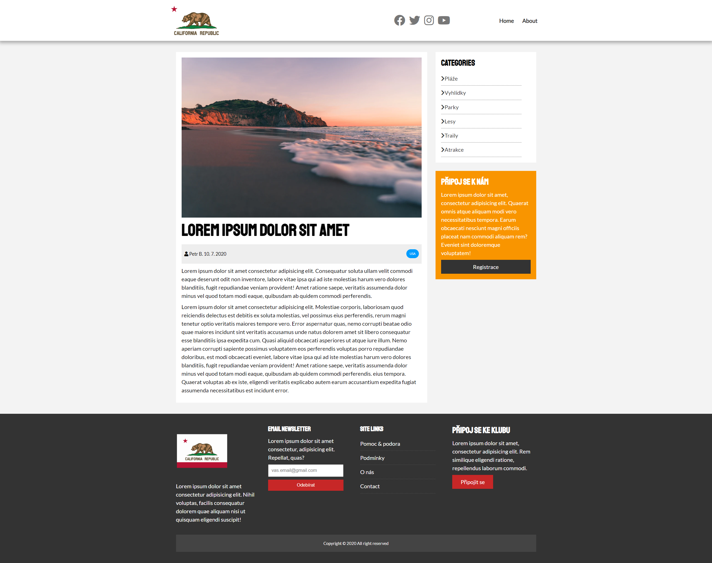
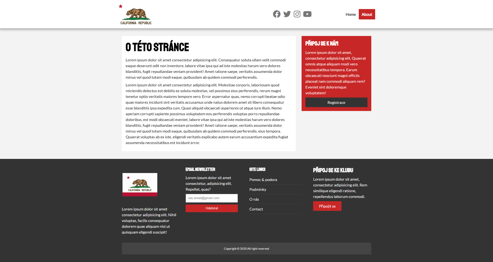

# UDEMY---California-news-grid
This is HTML, CSS excersice to practise a CSS grid. This challenge is from the UDEMY course <a href="https://www.udemy.com/course/modern-html-css-from-the-beginning/">"Modern HTML &amp; CSS From The Beginning (Including Sass)"</a> from <a href="https://www.udemy.com/user/brad-traversy/">Brad Traversy</a>. 

Site has 3 HTML files (<b>Homepage</b>, <b>About</b> and <b>Article</b>).

## HOMEPAGE site looks like this 🖥️⬇️

## ARTICLE PAGE site looks like this 🖥️⬇️

## ABOUT PAGE site looks like this 🖥️⬇️

